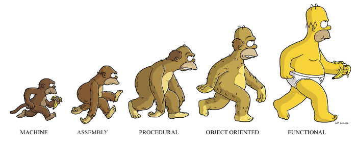
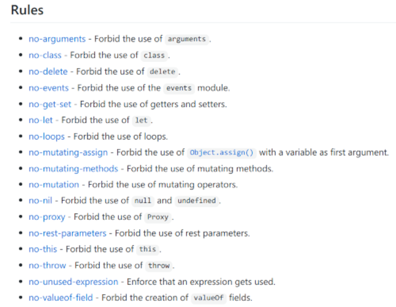
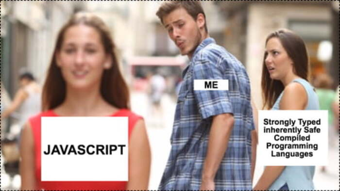
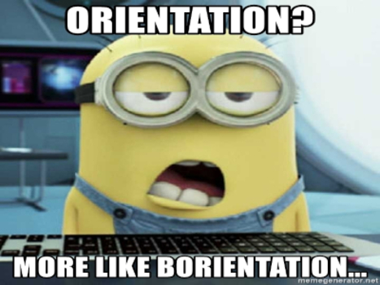
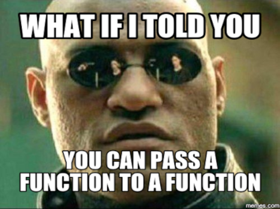
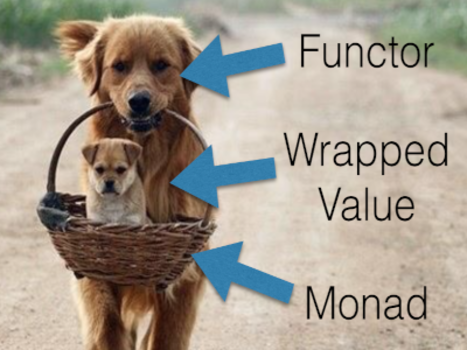
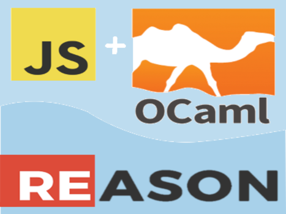
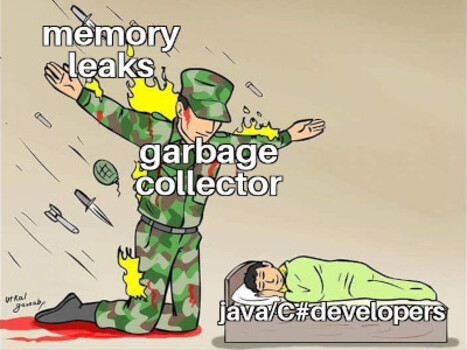

DESCRIPTION
===========

### What is SE-2123?

* all about learning other not-so-mainstream paradigms: **functional** (FP) and **procedural**. 
  - In SE 1223, you have learned the more mainstream OOP.

### Not a continuation of SE-1223

* Despite the name _"Software Development III"_, it's not a continuation, or a _Part 3_
  - The continuation of SE-1223 is SE-2122 (Software Component Design)
    + to be offered in the 3rd subterm
    + SE-2122 focuses mainly on Design Patterns that have OOP roots
  - Part 1 of SE-2123 actually forbids many OOP techniques
  - however, many things learned in SE-1223 are needed:
    + object composition (treated as data structures in FP)
    + immutable objects, defensive copies
    + pure, idempotent getters
  - OOP needed for compare and contrast with FP

### Split into two parts

* Part 1 is Functional Programming
  - central activity in OOP is creating objects from other objects (object composition)
  - central activity in FP is creating functions from other functions (function composition)
* Part 2 is Low-level Programming with Manual Memory Management
  - procedural programming with C
  - object-oriented programming with C++
  - [why?](https://github.com/ossu/computer-science/blob/master/FAQ.md#why-do-you-recommend-skipping-the-second-half-of-cs50)

### Overview of FP (1/2)

+ OOP is usually seen as somewhat the opposite of FP
  - a common misconception is that without classes, and using only the `function` keyword (e.g. JS),
    it is now FP
  - it could be procedural (the middle monkey)
    + procedural and OO are extensions of **imperative programming**

### Ovewview of FP (2/2)

  
  

  <ul style="font-size: 0.8em">
  <li>FP FP it's not a simple transition.</li> 
  <li>Many OOP (and imperative, and procedural) techniques are forbidden in FP.</li>
  <li>
    Can you imagine coding without
    <ul>
    <li>classes, setters, getters</li>
    <li>mutations (e.g. <code>+=</code>)</li>
    <li><strong>LOOPS?</strong> 😱😱😱</li>
    <li><code>null</code>s, <code>throw</code>s</li>
    </ul>
  </li>
  </ul>
  

### Which FP language? (1/3)

Your batch already had JS in SE-1121, lucky you 😂

### Which FP language? (2/3)

* But why JS, I ♥ Dart so much - less errors!
  - only lecture demos will be in JS
  - nobody is forced to use JS in any activities
  - but make sure your language has autocurrying, which Dart can't do, even with a lib
  - will use ReasonML when Part 1 is about to end, better type-safety than Dart! (no `dynamic` type)
* SE-2125 (Web Application Development) in the second subterm will be in JS
  - the browser can only understand JS
  - less languages to learn

### Which FP language? (3/3)

* Many FP advocates recommend JS
  - many people know JS, it's easier to share ideas with them using a language they know
  - JS is not a perfect FP language
    + it was designed to be like Java, and tried to be OO
    + but it is a very capable, and good enough FP language for most occasions
    + Read [this article](https://medium.com/javascript-scene/why-learn-functional-programming-in-javascript-composing-software-ea13afc7a257)
  - why switch to another FP language in the end?
    + just for experience with an FP-first language, and for comparison
    + FP can be [unnatural in JS](https://hackernoon.com/functional-programming-in-javascript-is-an-antipattern-58526819f21e), and you have to fight it sometimes
    + you can do your final project in JS, ReasonML, or any FP langauge

COURSE OUTLINE
==============

### What we'll learn (1/7)

Orientation and review of topics from SE-1222 (Data Structures) and 
SE-1223 (Software Development II)

### What we'll learn (2/7)

We'll first learn the main ingredients that makes FP possible:  first-class fns and higher-order fns

### What we'll learn (3/7)

We'll learn another core style in FP, inspired by Math:  pure functions and immutability

### What we'll learn (4/7)

We'll learn how to do the main FP thing:  function composition, and currying (see [FP in 5 minutes](https://slides.com/gsklee/functional-programming-in-5-minutes))

### What we'll learn (5/7)

Remember `no-nil` and `no-throw`?  We'll discuss how FP handles nulls and exceptions

### What we'll learn (6/7)

Translate all FP techniques you learned in JS into another language that emphasizes FP from the 
get-go.

### What we'll learn (7/7)

Low(ish)-level programming and manual garbage collection with C/C++, if the subterm can
get this far

### Pre-requisites

* SE 1222 - Data Structures
  - lists: emphasis on singly-linked lists (default data struct in ReasonML, but not ReScript)
  - maps, sets, trees
  - [**recursion**](https://github.com/jfmengels/eslint-plugin-fp/blob/master/docs/rules/no-loops.md) _(now you know why there the `no-loops` rule)_
* SE 1223 - Software Development II
  - object composition (very useful)
    + one-to-one and one-to-many is still valid in FP
    + instead of objects, FP languages call them `struct`s or records
  - FP techniques borrowed by OOP 😱:
    + immutability
    + defensive copies

#### Which courses need SE-2123 as a prerequisite?

* officially:  SE 3122 (Operating Systems) for C/C++
  - especially if you go through [Nand2Tetris](https://github.com/ossu/computer-science/blob/master/FAQ.md#why-do-you-recommend-skipping-the-second-half-of-cs50)
* unofficially:  most SE courses starting 2nd subterm
  - especially SE-2125 (Web App Dev't)
    + doing Node.js for the backend requires a lot of FP, with currying sprinkled here and there
    + using imperative programming or OOP will most likely lead to concurrency bugs
    + you can somehow survive without FP on the frontend, just use Vue for your final project, and
      not React (or use Angular if you can do Typescript and DI)
  - many FP techniques are useful in general, master before advancing in BSSE